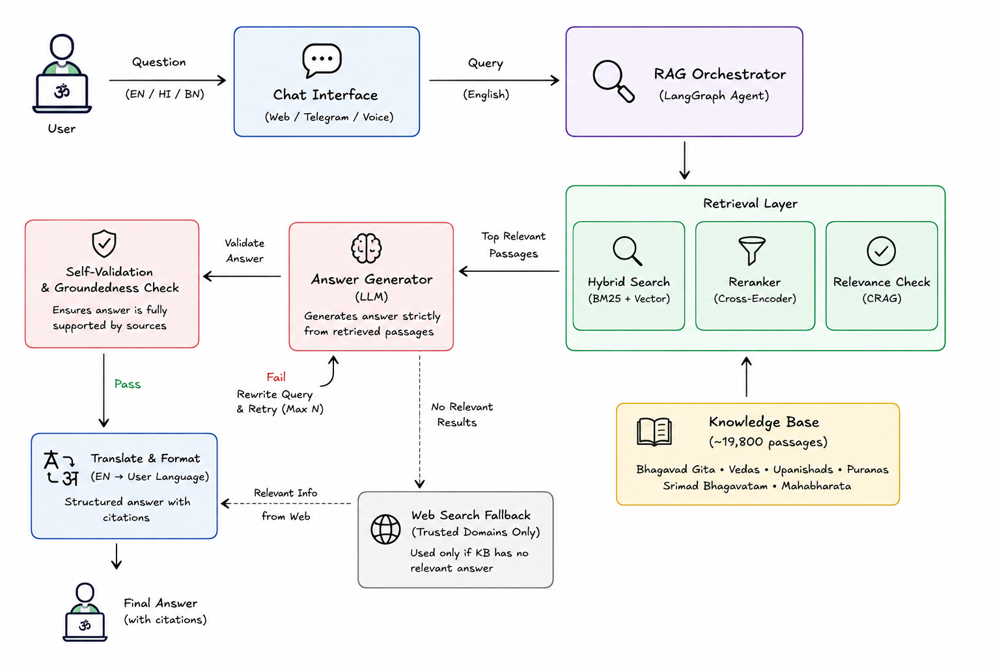

# 🕉️ Sanatan AI — Multilingual Sanatan Dharma RAG Agent

An **agentic, citation-grounded Retrieval-Augmented Generation (RAG) chatbot** that answers questions about Hindu philosophy and spirituality strictly from authentic scripture — the Bhagavad Gita, the four Vedas, the 108 Upanishads, the 18 Puranas, Srimad Bhagavatam, and the complete Mahabharata — with self-correcting hallucination checks and a trusted-domain web-search fallback for the rare cases where the local knowledge base has no answer.

Built for use by ISKCON devotees and anyone seeking accurate, respectfully-framed, scripture-cited guidance rather than generic AI opinion.

---

# 📌 1. Project Overview

Most "AI + Hindu scripture" chatbots available today are built around a single text (usually just the Bhagavad Gita) and answer in a loose devotional persona, with no guarantee the citation is real or the verse actually exists. That's a real risk for a tool people may turn to for genuine guidance.

**Sanatan AI** takes a different approach: it never lets the LLM answer from memory. Every response is generated strictly from scripture passages retrieved by a hybrid search pipeline, and every generated answer is automatically re-checked for groundedness before it reaches the user — if the AI's answer contains a claim the retrieved excerpts don't support, the system automatically rewrites the query and retries, rather than shipping an unverified answer.

> *"Never invent a verse or claim not present in the excerpts. If nothing relevant exists, say so honestly."*

This principle — enforced in code, not just in a prompt — is the core design constraint behind every architectural decision in this project.

---

# 🎥 Demo

*(add a short screen recording / GIF of the chat UI here once available)*

---

# ⚡ 2. Key Features

✔️ **Multi-scripture knowledge base** — Bhagavad Gita, Four Vedas, 108 Upanishads, 18 Puranas, Srimad Bhagavatam, and the full 18-book Mahabharata (~19,800 indexed passages)

✔️ **Dual-index retrieval** — a verse-precise Gita index (Chapter + Verse citations) kept separate from a page/section-level index for the other five scriptures

✔️ **Hybrid Search** — BM25 keyword search + FAISS semantic vector search combined via an Ensemble Retriever, so both exact proper-noun matches (deities, specific Puranas) and loosely-phrased questions retrieve well

✔️ **Multi-Query Retrieval** — automatically generates alternate phrasings of the user's question to widen recall before ranking

✔️ **Cross-Encoder Reranking** — re-scores the combined candidate pool and keeps only the most genuinely relevant passages before they reach the LLM

✔️ **Corrective RAG (CRAG)** — an automatic relevance grader checks retrieved content; on a weak match, the system rewrites the query and retries before ever falling back to the web

✔️ **Self-RAG–style Groundedness Validation** — every generated answer is checked against its own cited sources; ungrounded answers are automatically regenerated

✔️ **Trusted-domain Web Search Fallback** (Tavily) — only triggers when local retrieval is genuinely insufficient, and is restricted to public-domain / official sources to avoid copyright and reliability issues

✔️ **Multilingual (English / Hindi / Bengali)** — automatic language detection, translation to English for retrieval, and translation of the final structured answer back into the user's language, citations preserved

✔️ **Citation-first, honesty-enforced output** — every answer is structured as Direct Answer → Gita Guidance → Supporting Scriptures → Explanation, and the system is explicitly instructed (and validated) to say "not found" rather than force a citation

✔️ **LangGraph agentic orchestration** — the entire reasoning flow (retrieve → grade → generate → validate → retry/fallback → format) is a compiled, inspectable state graph, not a single prompt

---

# 🏗️ 3. System Architecture



High-level flow:

1. A question arrives via the web chat, is language-detected and translated to English if needed
2. An intent classifier routes it to the Gita index, the general scripture index, or both
3. The Hybrid Retrieval layer (multi-query → BM25+vector ensemble → reranker) returns the top candidate passages
4. The Generator produces a structured, citation-only answer from those passages
5. The Validator checks the answer's groundedness against the retrieved excerpts
6. If ungrounded or the retrieval was weak, the graph loops back through a query-rewrite step (bounded retry count) — and only escalates to a trusted-domain web search if local scripture genuinely has nothing relevant
7. Once grounded, the Response Formatter assembles the final answer and translates it back to the user's original language

---

# ⚙️ 3.1 Data Ingestion & Knowledge Base Architecture

The knowledge base is built from two categories of source material, chunked differently based on their structure:

**Structured source (Bhagavad Gita)**
A CSV with one row per verse (Sanskrit shloka, transliteration, Hindi meaning, English meaning, word-by-word meaning) is loaded directly — no chunking needed, since each row is already a natural retrieval unit with precise Chapter + Verse metadata.

**Unstructured PDF sources (Four Vedas, 108 Upanishads, 18 Puranas, Srimad Bhagavatam)**
Extracted page-by-page with `PyPDFLoader`, then split with `RecursiveCharacterTextSplitter` (1000 char chunks, 150 char overlap). Front-matter and table-of-contents pages are explicitly skipped per file after manual inspection, since a naive fixed skip count was found to leak dot-leader TOC text into the index during development — each source's true content start page was verified before final ingestion.

**Web-sourced text (Mahabharata)**
All 18 books scraped from a public-domain 1883–1896 English translation (Kisari Mohan Ganguli, sacred-texts.com), section-by-section, with retry logic and incremental progress-saving so a network interruption never loses completed work. Cleaned of site navigation, footnotes, and page-number artifacts before indexing.

Every chunk carries a `source` and `reference` field (e.g. `"Chapter 3, Verse 8"` for the Gita, or `"18 Puranas, p.522"` for page-cited sources) so every retrieved passage can be cited exactly, never paraphrased into a vague attribution.

> ⚠️ **On licensing**: only public-domain or openly-licensed translations are included in this knowledge base. Commercially copyrighted commentary (e.g. Bhaktivedanta Book Trust's Prabhupada purports) was deliberately **excluded** from automated ingestion pending direct permission from the copyright holder — a request that remains open. This project treats copyright compliance as a hard constraint, not a technicality to route around.

---

# 🧠 3.2 Hybrid Retrieval Architecture

Retrieval is split into two independently-tuned indexes:

## 3.2.1 Gita Retriever
A single FAISS index over all ~700 verses, queried directly with a top-k similarity search. Kept intentionally simple — the corpus is small, well-structured, and the citations it returns (Chapter + Verse) are already maximally precise, so hybrid search and reranking add negligible value here.

## 3.2.2 Scripture Retriever (Vedas, Upanishads, Puranas, Bhagavatam, Mahabharata)
A three-stage pipeline, each stage added in response to a concretely observed failure mode during development:

```
User query
   │
   ▼
Multi-Query Retrieval        ← generates 2-3 alternate phrasings via LLM
   │
   ▼
Ensemble Retriever            ← BM25 (weight 0.4) + FAISS vector search (weight 0.6)
   │
   ▼
Cross-Encoder Reranker        ← ms-marco-MiniLM-L-6-v2, re-scores ~16 candidates → keeps top 5
```

- **Multi-Query Retrieval** exists because loosely-phrased questions ("is sports ok") retrieve worse than fully-articulated ones — generating variants closes that gap cheaply.
- **BM25 + vector ensemble** exists because pure semantic search under-weights exact keyword matches (e.g. a specific deity or Purana name) that a keyword search catches immediately.
- **Reranking** exists because both of the above stages, especially BM25 on a corpus with thousands of instances of common names (Arjuna, Krishna), can surface confidently-ranked but contextually irrelevant passages — the reranker is what actually filters this noise before it reaches the LLM.

This design was arrived at empirically: each stage was validated in isolation against real test queries (both narrative questions and keyword-anchored questions) before being wired together.

---

# 🤖 3.3 Agentic Orchestration (LangGraph)

The full reasoning flow is implemented as a compiled `LangGraph` state machine rather than a single prompt call, so each stage of reasoning is independently inspectable and retry-capable.

**Nodes:**

| Node | Responsibility |
|---|---|
| Detect & Translate | Identifies the input language and translates to English for retrieval |
| Intent Classifier | Routes the question to the Gita index, the general scripture index, or both |
| Retriever | Runs the appropriate hybrid retrieval pipeline |
| Generator | Produces a structured, citation-only answer from retrieved context (Groq LLaMA 3.3) |
| Validator | Grades the generated answer's groundedness against its cited excerpts |
| Query Rewrite | Reformulates the search query when retrieval or groundedness is weak, and retries (bounded attempt count) |
| Web Search | Trusted-domain fallback (Tavily), triggered only when local retrieval genuinely has nothing relevant after retries |
| Response Formatter | Assembles the final structured answer and translates it back to the source language |

**Corrective loop:** if the Validator marks an answer as ungrounded, the graph does not simply return it — it loops back through Query Rewrite → Retriever → Generator, up to a bounded number of attempts, before either succeeding or falling back to web search. This is the project's implementation of **Corrective RAG (CRAG)** combined with a lightweight **Self-RAG**-style groundedness check, scoped down from the full academic techniques (which require specially fine-tuned reflection-token models) into something achievable with a general-purpose LLM and a couple of extra graph nodes.

---

# 🌐 3.4 Web Search Fallback — Trusted Domains Only

The web fallback is deliberately **not** an open web search. It is restricted via Tavily's domain filtering to a small allowlist of public-domain / official sources:

```
sacred-texts.com · valmikiramayan.net · iskcon.org · gbc.iskcon.org · communications.iskcon.org
```

This list was arrived at deliberately: general search results include forums, SEO blogs, and unverified commentary that don't meet the accuracy bar this project requires. Sources with unclear or commercial copyright status (e.g. vedabase.io, which hosts copyrighted Prabhupada commentary) are explicitly **excluded** from the automated fallback for the same licensing reason noted in section 3.1.

---

# 🗣️ 3.5 Multilingual Pipeline

Rather than deploying a separate translation model (e.g. IndicTrans2) as a standing service, translation is handled directly by the existing LLM:

```
Hindi / Bengali question
        │
        ▼
Language detection (langdetect)
        │
        ▼
LLM translation → English  (for retrieval only)
        │
        ▼
   [ full RAG pipeline runs entirely in English ]
        │
        ▼
LLM translation → original language
   (Sanskrit shlokas and chapter/verse citations left untranslated)
```

This was a deliberate simplification decision made after validating that direct LLM translation preserved both answer quality and — critically — the system's citation-honesty behavior (i.e., "no relevant verse found" statements survived translation intact, rather than being smoothed over into false confidence). A dedicated translation model remains a documented future option if quality needs later demand it.

---

# 🗄️ 4. Database Architecture

| Table | Purpose |
|---|---|
| `sessions` | One row per conversation session (id, created_at) |
| `messages` | Full conversation history per session — question, answer, sources, detected language, timestamp |

Currently backed by **SQLite** for local development. Flagged for migration to **PostgreSQL** before any multi-user production deployment, since SQLite's file-level locking does not handle concurrent writes safely under real simultaneous traffic.

---

# 🛠️ 5. Tech Stack

## Frontend

| Technology | Purpose |
|---|---|
| React | Chat UI |
| npm | Package management |

## Backend

| Technology | Purpose |
|---|---|
| FastAPI | REST + streaming API server |
| LangGraph | Agentic state-machine orchestration |
| LangChain | Retriever/tool abstractions |
| SQLite → PostgreSQL | Session & conversation storage |

## AI / ML / Retrieval

| Technology | Purpose |
|---|---|
| Groq (LLaMA 3.3 70B) | Generation, grading, translation |
| HuggingFace `bge-small-en-v1.5` | Embedding model (GPU-accelerated) |
| `cross-encoder/ms-marco-MiniLM-L-6-v2` | Reranking |
| FAISS | Vector similarity search |
| `rank_bm25` | Keyword-based sparse retrieval |
| Tavily | Trusted-domain web search fallback |

## Data Sources

| Source | Format |
|---|---|
| Bhagavad Gita | CSV (Sanskrit + Hindi + English, verse-level) |
| Four Vedas, 108 Upanishads, 18 Puranas, Srimad Bhagavatam | PDF (English translations) |
| Mahabharata (18 books) | Scraped public-domain HTML (sacred-texts.com) |

## Infrastructure (planned)

| Technology | Purpose |
|---|---|
| Vercel | Frontend deployment |
| Railway | Backend deployment |

---

# 📁 6. Repository Structure

```
Sanatan_dharma_chatbot/
│
├── frontend/                          # React chat UI
│   ├── src/
│   └── package.json
│
├── backend/                           # FastAPI application
│   ├── main.py                        # App entrypoint, routes, startup warm-up
│   ├── static/                        # Runtime media (audio, etc.)
│   │
│   ├── agent/
│   │   └── graph.py                   # LangGraph node definitions + compiled graph
│   │
│   ├── retrieval/
│   │   ├── gita_retriever.py          # FAISS-only Gita retriever
│   │   ├── scripture_retriever.py     # Multi-query + BM25/FAISS ensemble + reranker
│   │   └── embeddings.py              # HuggingFace embedding model loader (GPU)
│   │
│   ├── database/
│   │   ├── db.py                      # SQLite connection + session/message models
│   │   └── schema.sql
│   │
│   └── services/
│       ├── translation.py             # Language detection + LLM-based translation
│       └── web_search.py              # Tavily trusted-domain fallback
│
├── ingestion/                         # One-off data preparation notebooks/scripts
│   ├── day_01_data_ingestion.ipynb    # Gita CSV → FAISS index
│   ├── scripture_pdf_ingestion.ipynb  # Vedas/Upanishads/Puranas/Bhagavatam → FAISS
│   └── mahabharata_scraper.ipynb      # sacred-texts.com scraper with resume support
│
├── Data/                              # Raw source PDFs (excluded from deployment)
├── gita_faiss_index/                  # Persisted Gita FAISS index
├── scripture_faiss_index/             # Persisted scripture FAISS index
├── scripture_chunks_cache.json        # Cached chunk text/metadata for BM25 rebuild
├── mahabharata_progress.json          # Scraped Mahabharata corpus (resumable)
│
├── .env.example
├── .gitignore
└── README.md
```

---

# 🚀 7. Local Setup

## Prerequisites

- Python 3.10+
- Node.js 18+
- An NVIDIA GPU is recommended (not required) for faster embedding/reranking
- API keys: Groq, Tavily, (optional) Hugging Face token

---

## Backend Setup

```bash
cd backend
pip install -r requirements.txt
```

Create `.env`:

```env
GROQ_API_KEY=your_groq_api_key
TAVILY_API_KEY=your_tavily_api_key
HF_TOKEN=your_huggingface_token
DATABASE_URL=sqlite:///./sanatan_dharma.db
```

Run:

```bash
uvicorn backend.main:app --reload
```

> First run will build the FAISS indexes from `Data/` and the Gita CSV if they don't already exist on disk — subsequent runs load the persisted indexes directly.

---

## Frontend Setup

```bash
cd frontend
npm install
```

Create `.env`:

```env
VITE_API_URL=http://127.0.0.1:8000
```

Run:

```bash
npm run dev
```

---

# 🔌 8. API Endpoints

| Method | Endpoint | Description |
|---|---|---|
| `GET` | `/api/chat/stream` | Ask a question — streams the agent's structured, cited response |
| `GET` | `/api/db/sessions` | List conversation sessions |
| `POST` | `/api/db/sessions` | Create a new conversation session |
| `GET` | `/api/db/sessions/{session_id}/messages` | Retrieve full history for a session |

---

# 🔮 9. Future Improvements

* **Valmiki Ramayana** ingestion — currently the one major itihasa missing from the knowledge base
* **Licensed Prabhupada commentary** — pending permission from the Bhaktivedanta Book Trust, to add devotional depth aligned with the project's ISKCON audience
* **Multi-acharya commentary** (Shankaracharya, Ramanuja, Madhva) for the Gita, sourced from public-domain academic archives, to present multiple traditions neutrally rather than a single translation layer
* **Telegram / WhatsApp bot channels** — the architecture already supports this at the API layer; only the channel adapters remain
* **Voice input/output** via Whisper (STT) and a TTS engine, for accessibility and hands-free use
* **PostgreSQL migration** for safe concurrent multi-user production use
* **Conversation memory in the LangGraph flow** — currently sessions are stored, but multi-turn contextual follow-up ("what about towards family specifically?") is not yet threaded into agent state
* **Contextual Compression** and **Self-Query metadata filtering** — identified as available refinements to the retrieval layer, not yet implemented since no concrete failure mode has required them so far
* **Automated regression test suite** — formalize the manually-run test question set used throughout development into a repeatable evaluation harness (citation accuracy, hallucination rate, latency)

---

# 📬 Contact

Built by **Satyabrata Das Adhikari**

📧 satyabratadasadhikary7@gmail.com

🔗 [GitHub](https://github.com/satya-py)
